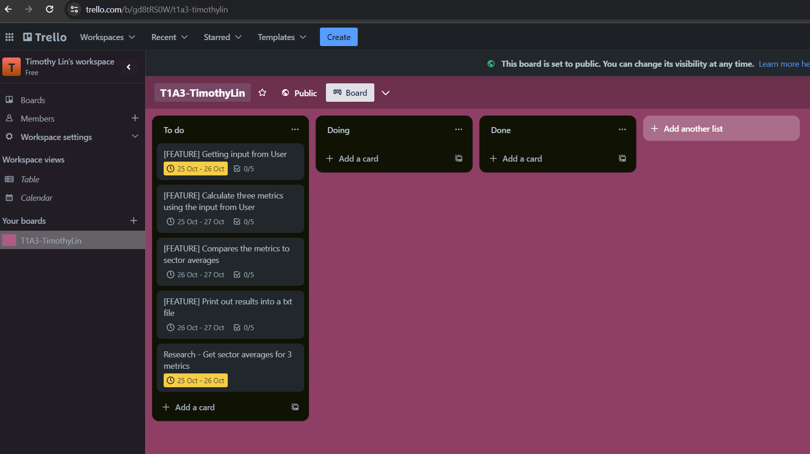
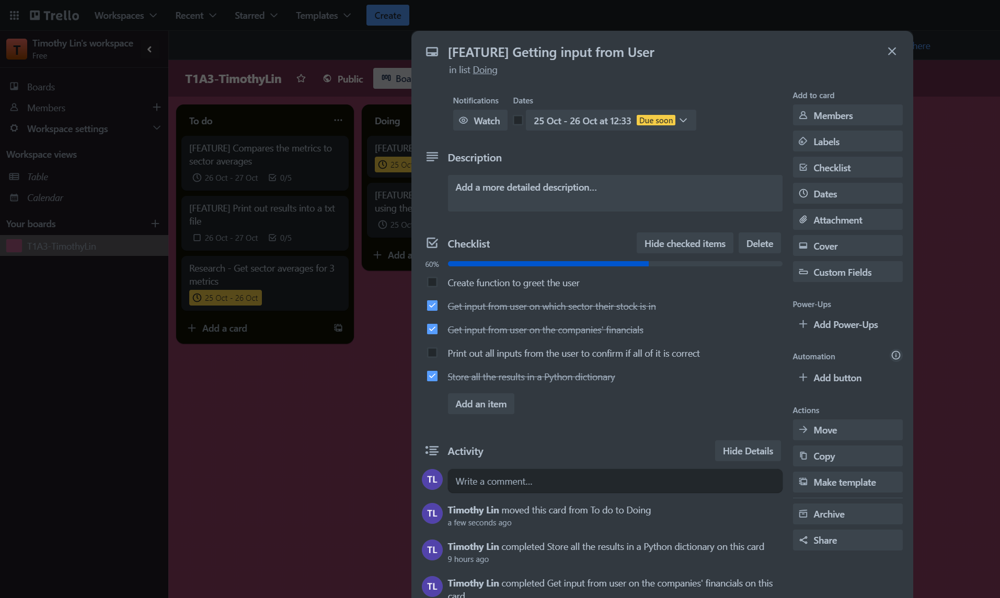
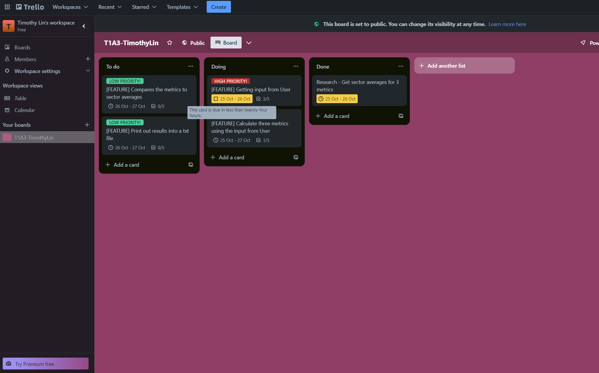
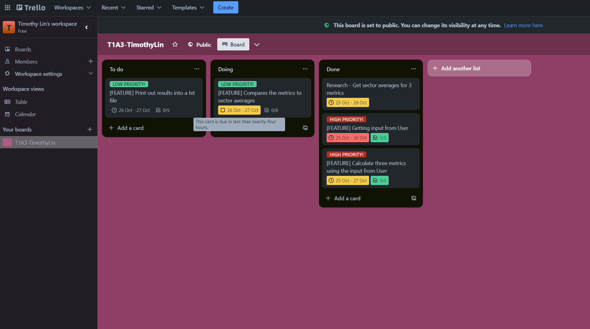
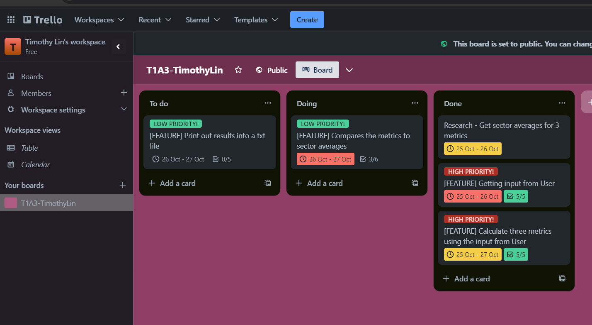
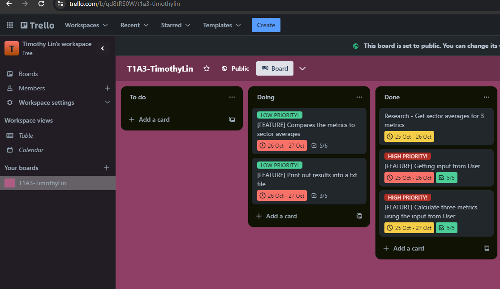
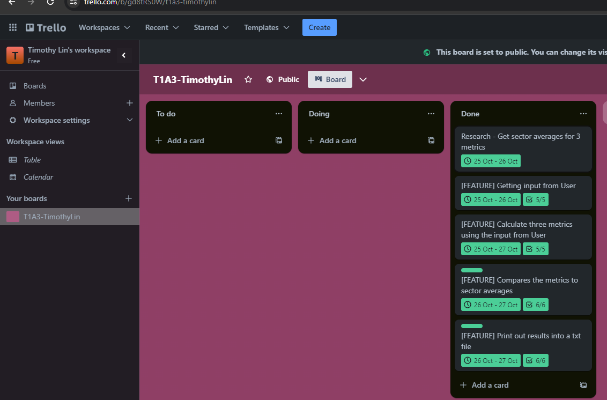

# TimothyLin_T1A3

## Link to Github
[GITHUB](https://github.com/timtam8181/TimothyLin_T1A3)

## Link to Trello
[TRELLO](https://trello.com/b/gd8tRS0W/t1a3-timothylin)

## Code Style Guide
[PEP8](https://peps.python.org/pep-0008/#documentation-strings)

## Features

### INPUT
Receives input from the user. The terminal application will ask for financial information about the company they wish to analyse.
### Calculate 3 metrics
Based on the financial information received from the user, it will calculate Price/ Earnings ratio, Debt to equity ratio and Free cash flow.
### Compares the three metrics against the sector averages
Once the three metrics are calculated, the application will then compare them against their respective sector averages and give a comment about the results. The terminal application will also allow the user to compare more than one company.
### Prints results into a txt file which then opens a notepad that can be saved
Once the user has finished, the results will be printed out to a text file and will automatically be open on a notepad which can be saved.

## Implementation plan
### Screenshots








## Steps to install the application
- Step 1: Open UBUNTU terminal
- Step 2: Switch to a folder where the terminal application will be saved. Clone with command: ```git clone git@github.com:timtam8181/TimothyLin_T1A3.git```
- Step 3: Open cloned folder, first change directeroy: ```cd TimothyLin_T1A3/src``` then ```run bash wrapper.sh```


## Dependencies required by the application
- colorama==0.4.5  
- pyfiglet==0.8.post1  
- pytest==7.1.3

